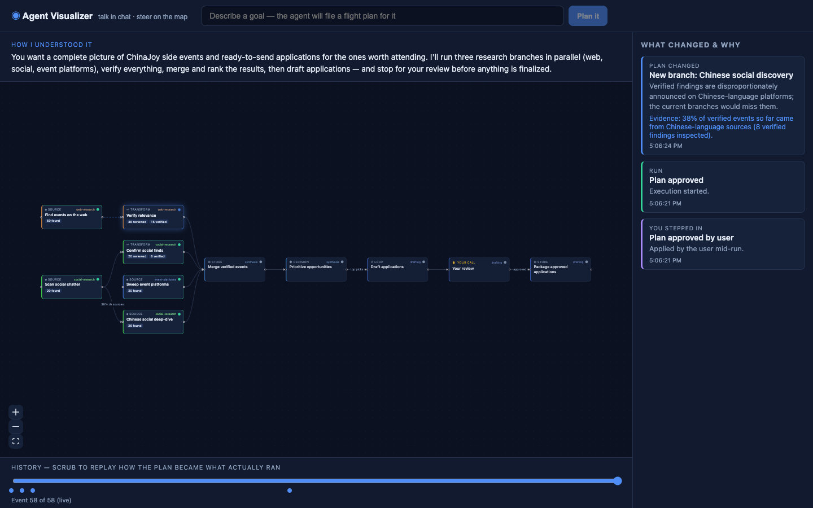
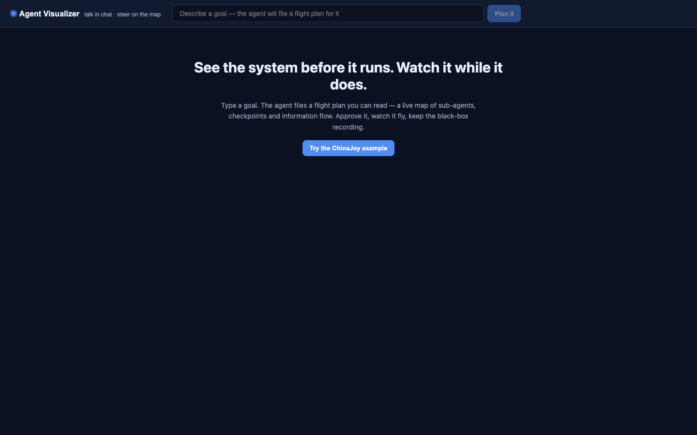
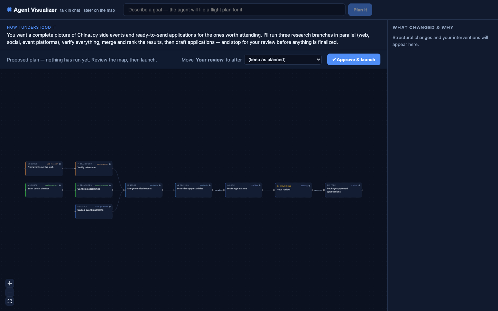

<div align="center">

# agent-visualizer

**Mission control for delegated AI work** — watch and steer the agent's plan as a live diagram, not a chat spinner.

</div>

<p align="center">
  
</p>

<p align="center">
  
  
</p>

You talk to the agent in chat. You watch it through a map.

One object — the **plan graph** — in three modes:

1. **Proposed plan** — a flight plan from your prompt: sub-agents, information flow, approval gates. Review (and move the gate) before anything runs.
2. **Live system** — the same diagram becomes the dashboard: nodes light up, counters tick, new branches grow with reason cards when the agent adapts.
3. **Audit trail** — scrub the timeline to replay how the plan became what actually ran. Export the event log.

## Try it (2 minutes)

```bash
pnpm install
pnpm dev        # server :4400 · web :5180 (proxies /api)
```

Open [http://localhost:5180](http://localhost:5180) → click **Try the ChinaJoy example** → approve the plan → watch the map.

No API key required for that demo (deterministic domain planner). Optional:

| Env | Effect |
|-----|--------|
| `ANTHROPIC_API_KEY` | Claude plans arbitrary prompts |
| `GEMINI_API_KEY` | Gemini instead ([AI Studio](https://aistudio.google.com) free tier) |
| `PLANNER_MODEL` | Override model id |
| `SIM_SPEED` | Slow down / speed up simulated work (tests use `60`) |
| `PORT` | Server port (default `4400`) |
| `DATA_DIR` | Where run JSONL logs live |

## The honest-diagram contract

The plan JSON is both the **render source** and the **execution contract**. The orchestrator may deviate only by emitting a `plan_amendment` with a mutation, a reason, and evidence — the diagram is ground truth, never a narration of it.

- **Structural** events (new branch, gate, pivot — ~5–15 per run) mutate the graph and show annotation cards
- **Operational** events (retries, counters) only update state inside existing nodes

## What you can do mid-run

- Pause or kill a branch
- Edit instructions on a node
- Approve / edit / reject at human gates
- Scrub the timeline after finish
- Share / reload runs via `#/run/<id>`

Crashed mid-run? On next boot the server closes it with an explicit `aborted` marker — the map never pretends a dead run is alive.

## Architecture

| Package | Role |
|---------|------|
| `shared/` | Plan schema, two-tier events, pure reducer (live + replay) |
| `server/` | Planner + orchestrator, SSE stream, Express on `:4400` |
| `web/` | React + React Flow UI on `:5180` |

Node ontology: `source` · `transform` · `store` · `decision` · `human_gate` · `loop`

## Scripts

```bash
pnpm test
pnpm lint
pnpm typecheck
pnpm build
```

## Deploy

```bash
docker build -t agent-visualizer .
docker run -p 4400:4400 -v agent-viz-data:/data agent-visualizer
```

Or: `pnpm install && pnpm --filter web build && pnpm start` (serves everything on `PORT`). Health: `GET /healthz`.

## License

See repository.
